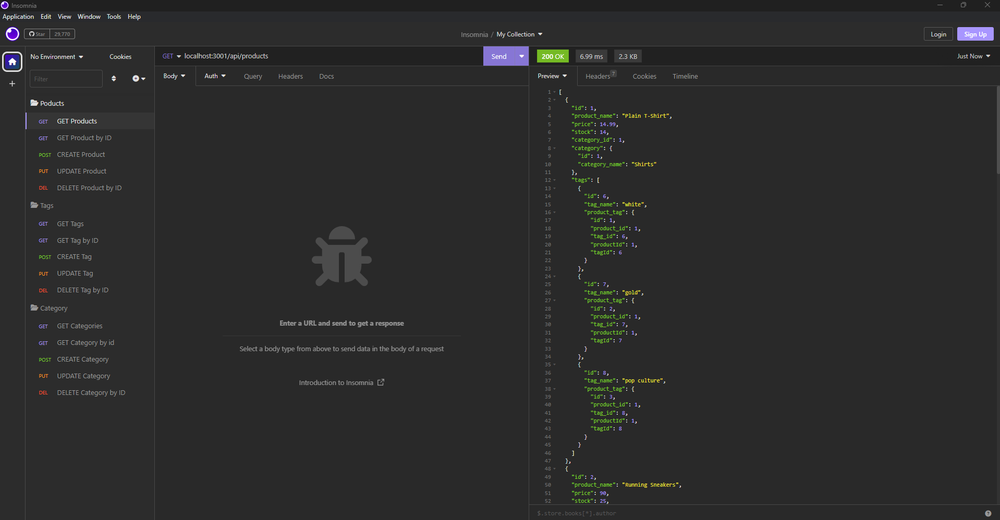

# E-commerce Back End

## User Story
AS A manager at an internet retail company
I WANT a back end for my e-commerce website that uses the latest technologies
SO THAT my company can compete with other e-commerce companies

## Description
 Employye Tracker starts from command-line application that accepts user input. User starts answer for questions and enter information in terminal prompt mode, as a view all departments, view all roles, view all employees, add a department, add a role, add an employee, and update an employee role. This information is added to the sections. In the end user can see all nessesary info in terminal.  

## Github reference
https://github.com/secretariuss/e-commerce-back-end

## Video reference
https://drive.google.com/file/d/1aEHG0e2m7Ndf_jn_oMwxeBKLYIrNbSVt/view

## Screen shots

The following scrshots shows the web application's:

## Acceptance Criteria
GIVEN a functional Express.js API
WHEN I add my database name, MySQL username, and MySQL password to an environment variable file
THEN I am able to connect to a database using Sequelize
WHEN I enter schema and seed commands
THEN a development database is created and is seeded with test data
WHEN I enter the command to invoke the application
THEN my server is started and the Sequelize models are synced to the MySQL database
WHEN I open API GET routes in Insomnia Core for categories, products, or tags
THEN the data for each of these routes is displayed in a formatted JSON
WHEN I test API POST, PUT, and DELETE routes in Insomnia Core
THEN I am able to successfully create, update, and delete data in my database

  ## Table of Contents
  * [Installation](#installation)
  * [Usage](#usage)
  * [How to Contribute](#how-to-contribute)
  * [Tests](#tests)
  * [Questions?](#questions)
  
  ## Installation
  Use in the terminal, clone from github, run npm install
  ## Usage
  run in terminal npm run start
  ## How to Contribute
  [Contributor Covenant](https://www.contributor-covenant.org/)  
  In contributor covenant
  ## Tests
  run npm run test in terminal
  ## Questions?
  ### Reach me here: 
  [secretariuss](https://github.com/secretariuss)  
  secretarius@ukr.net